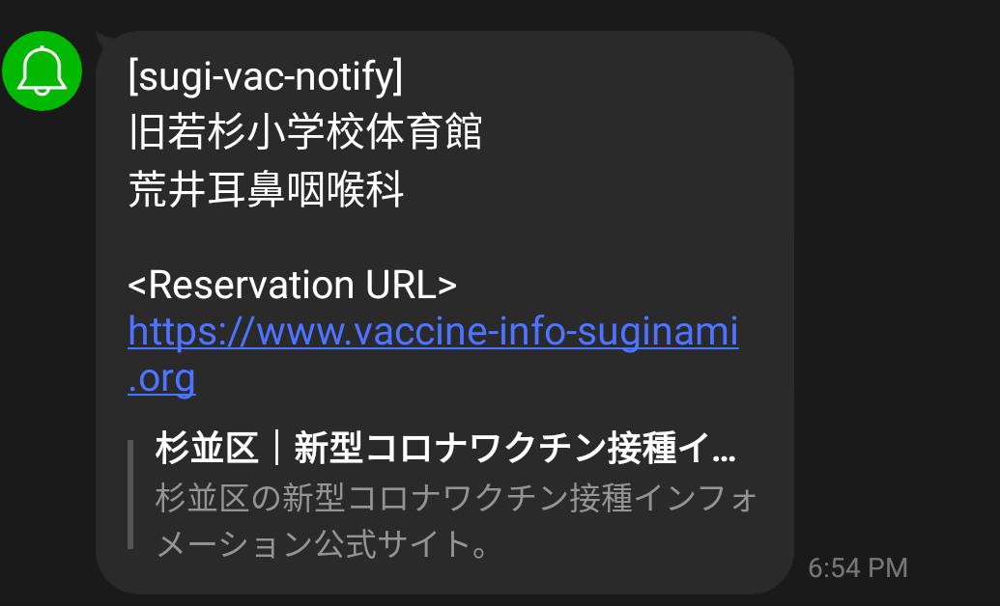

# COVID-19 Vaccine Reservation Status Notification in Japan
The vaccine reservation service by local government annoys me because difficult to find seat and no notification for empty seats. That's why I made this. I could reserve seat where I want after 2 hours from making this.

## Supported Notification
- LINE Notify

## Sample


## Overview
This app can gather reservation status in local government service and notify to your mobile periodically. Consisted of below compornents.

### Vaccine Checker
[vaccine-checker](./vaccine-checker) gathers reservation status to find empty seats and notifies via LINE when setting valid LINE Notify token.

You have to find out the API endpoints which are **All vaccination service places** and **Available places to reserve**. It will be easy to find them by using Developer mode in Google Chrome.

[vaccine-checker](./vaccine-checker) is tested the API provided **vaccines.sciseed.jp**. If your found APIs is not provided **vaccines.sciseed.jp**, will not working because data scheme is not same I guess.


#### Example
API endpoints are difference from each local governments. Belows are at Suginami in Tokyo.

- All vaccination service places: https://api-cache.vaccines.sciseed.jp/public/131156/department/
- Available places to reserve: https://api-cache.vaccines.sciseed.jp/public/131156/available_department/

#### Parameters
Set OS environment values as app prameters when you use.

| KEY | VALUE | Required | Default | Example | Note |
| :---: | :---: | :---: | :---: | :--- | :---: |
| VACCINE\_RESERVATION\_URL | URL of vaccine reservation service | yes | NA |  | This URL will be used at bottom of notification message to be available to reserve quickly. |
| VACCINE\_ALL\_PLACE\_URL | API endpoint which we can gather all vaccination service places| yes | NA | https://api-cache.vaccines.sciseed.jp/public/\<ID\>/department/ |  |
| VACCINE\_AVAILABLE\_PLACE\_URL | API endpoint which we can gather available places to reserves | yes | NA | https://api-cache.vaccines.sciseed.jp/public/\<ID\>/available_department/ |  |
| LINE_TOKEN\_FILE\_PATH | File path saved LINE notify tokens | 必要 | NA | /app/config/line-token.conf | You should be same path as line-notify-web. |
| NOTIFY\_DURATION\_SEC | Duration **seconds** to check reservation status and notify | yes | NA | 3600 | To avoid high load, reload is not allowed by the reservation services. So use your common sense to set this value. lol |

### LINE Notify Web
[line-notify-web](./line-notify-web) handles redirection to Line Notify Auth, callback and token saving for Line Notify.

Before set up this, you have to register [Line Notify](https://notify-bot.line.me/ja/)to get Client ID and Secret.

You **need to prepare Web server which be able to be accessed from internet** to receive call back from LINE notify

#### Parameters
Set OS environment values as app prameters when you use.

| KEY | VALUE | Required | Default | Example | Note |
| :---: | :---: | :---: | :---: | :--- | :---: |
| LINE\_TOKEN\_FILE\_PATH |  File path to save LINE notify tokens | yes | NA | /app/config/line-token.con |  |
| LINE\_NOTIFY\_CLIENT\_ID | LINE notify Client ID | yes | NA |  |  |
| LINE\_NOTIFY\_CLIENT\_SECRET | LINE notify Client Secret | yes | NA |  |  |
| LINE\_NOTIFY\_CALLBACK\_URL | LINE notify Callback URL | yes | NA | https://tak-motors.com/callbac |  |
| WEB\_SERVER\_PORT | Web server port | yes | NA | 80 | Web server is used by redirection to LINE auth and Callback. |

#### URI
- LINE Notify Registration: http://\<YOUR_IP\>/line/notify
- LINE Notify Callback: http://\<YOUR_IP\>/line/callback

### Container Images
- [vaccine-checker](https://hub.docker.com/r/fideltak/vaccine-checker)
- [line-notify-web](https://hub.docker.com/r/fideltak/line-notify-web)

### Deploy into k8s
I tested this on k8s like below architecture. Sample manifests are [here](./k8s).

```
┌────────────────┐  ┌────────────────┐
│line-notify-web │  │vaccine-checker │
│                │  │                │
│                │  │                │
│                │  │                │
└───────▲────────┘  └───────▲────────┘
        │                   │
        │                   │
      ┌─┴───────────────────┴────┐
      │ PV RWX                   │
      │         line-token       │
      │                          │
      └──────────────────────────┘
```

To share token file on each containers, I'm using RWX volume.